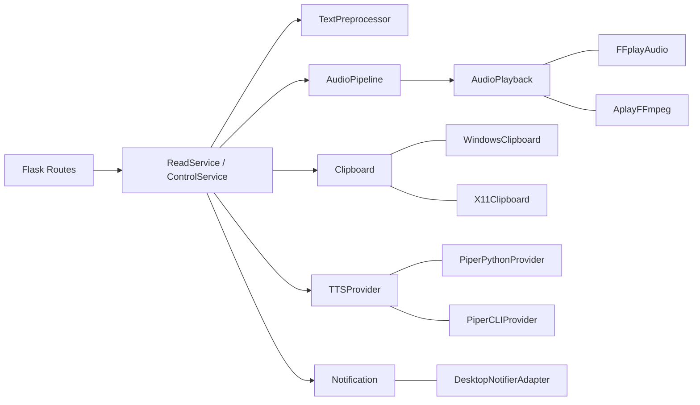

# Architecture Change



```
tts_reader/
  app/
    services.py         # ReadService, ControlService
    pipeline.py         # AudioPipeline
    preprocessor.py     # DefaultPreprocessor
  domain/
    ports.py            # Clipboard, TTSProvider, AudioPlayback, Notification
  adapters/
    clipboard/
      windows.py
      x11.py
    audio/
      ffplay.py
      aplay_ffmpeg.py
    tts/
      piper_python.py
      piper_cli.py
    notify/
      desktop_notifier.py
      null.py
  web/
    http.py             # Flask app factory
  config.py             # argparse -> Config dataclass
main.py                 # tiny: build_services + run app
```